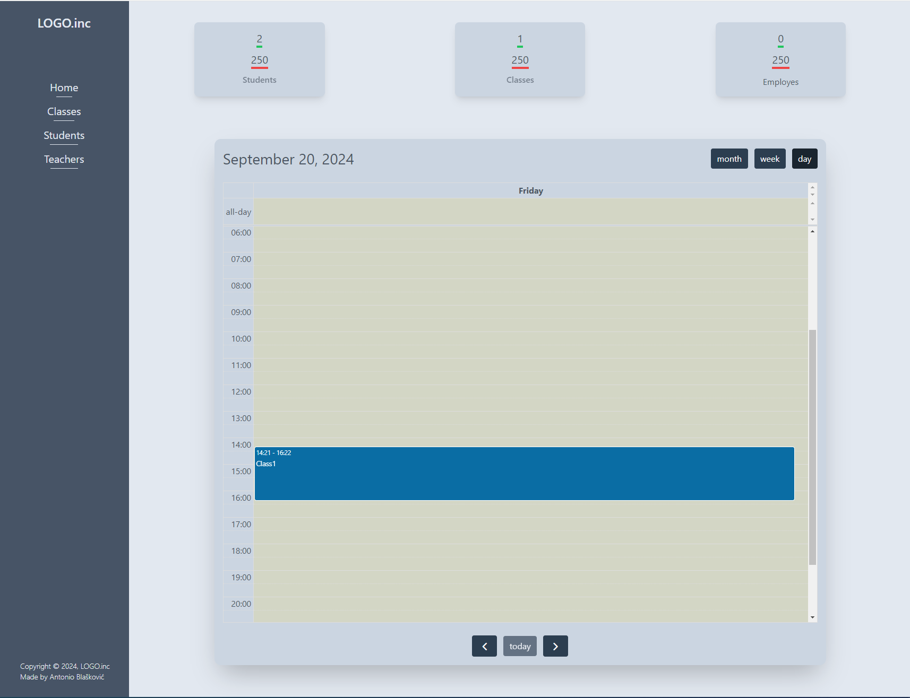
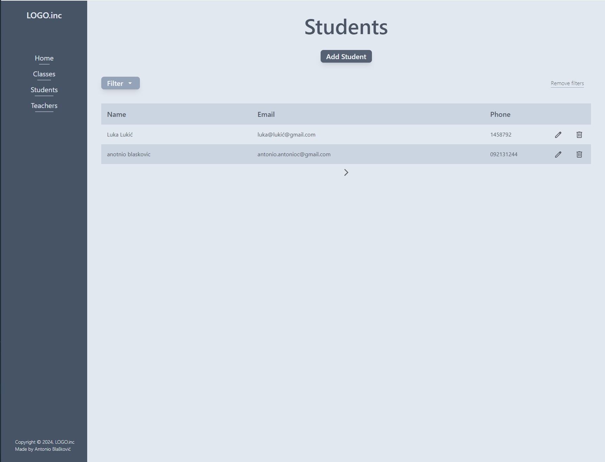
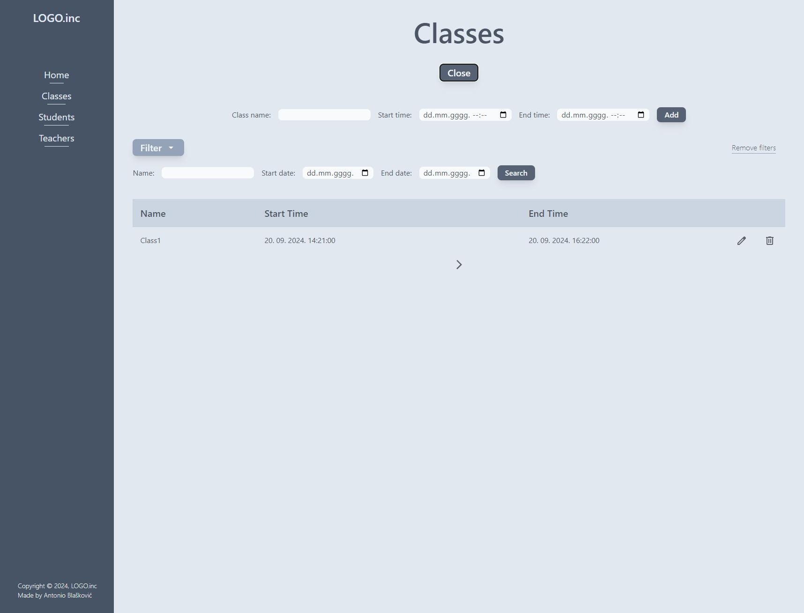

# TUTORING SCHOOL ERP SYSTEM

---

I wanted to create a fullstack app using Express.js and EJS to solidify my knowledge before turning to React.
App provides a student/class/teacher managment system with classes being displayed in Calendar.

---

## Features?

- pagination, and search / filtering
- using FullCalendar.js for displaying calendar
- CRUD operations on tables in PostgreSQL

## App images

 

> Work in progress!
